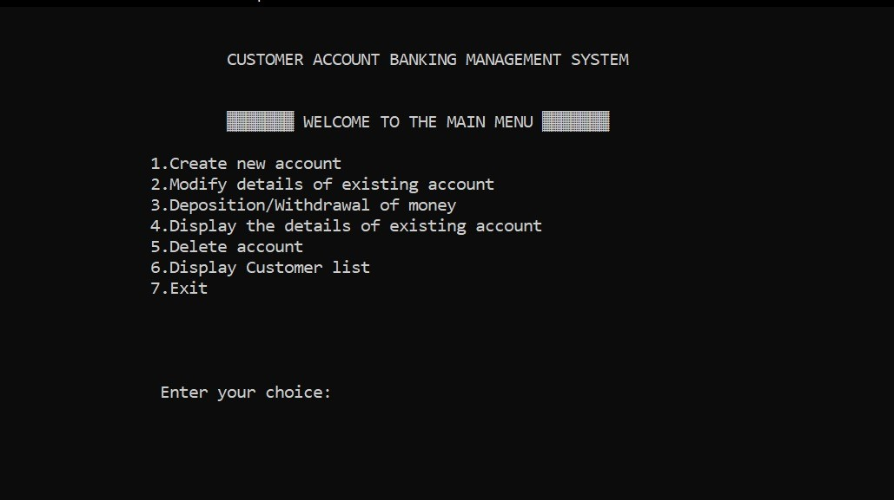
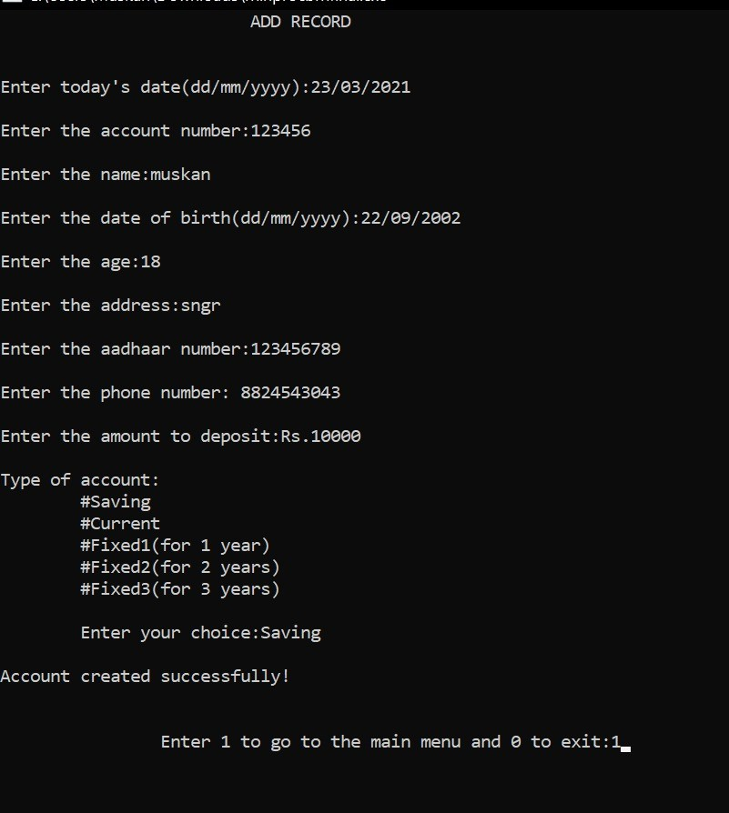
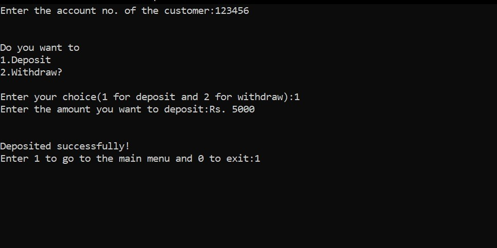
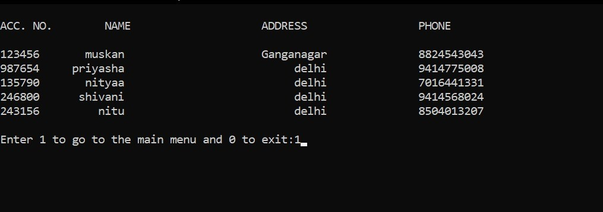
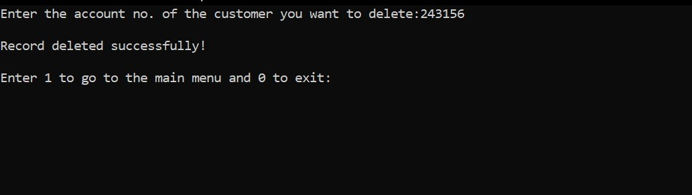
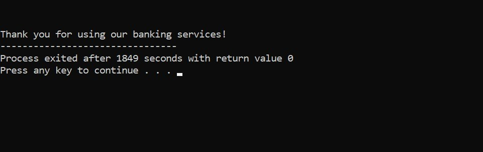

<!DOCTYPE html>
<html lang="en" dir="ltr">

<head>
  <meta charset="utf-8">
  <title>❃❃C Bank Management System❃❃</title>
</head>

<body style="background-color:#F1D4D4;">
  <h1>Bank Management System</h1>
  <table cellspacing="20">
    <td></td>
    <td>
      

        <em>Mini Project in <strong><a href="https://en.wikipedia.org/wiki/C_(programming_language)">C Programming Language</a></strong>.</em>
      

  

    The objective of the project “Bank Management System” is to develop online banking system
    for banks. In this bank management system we have automated all the banking process. In our
    bank management system user can check his balance online and he can also deposit or withdraw
    money to other account online. Using this program, you can keep record for daily Banking
    transactions. The main purpose of developing bank management system is to design an
    application, which could store bank data and provide an interface for retrieving customer related
    details with 100% accuracy.

  

    </td>
  </table>

  

  <h2>Introduction</h2>
  <table cellspacing="10">
    <thead>
      <th>Hardware Requirements</th>
      <th>Software Requirements</th>
    </thead>
    <tbody>
      <tr>
        <td>Laptop or PC</td>
        <td><a href="https://sourceforge.net/projects/orwelldevcpp/">Dev C++(Compiler MinGW)</a></td>
      </tr>
  </table>
  

    This <strong>bank management system</strong> allows the user to add new customer account, delete account and
user can also modify existing user account information. Using this system user can also search
any individual account in few seconds. Using our bank management system user can also check
any translation in any account. Our system also provide security check to reduce fraud. The
system will check the user’s existence in the database and provide the set of services with respect
to the role of the user.
  

  

    The following functions have been used in our program to provide the various facilities in our
    bank management system-
  

  <ul type="square">
    <li>
      <strong>menu()</strong> – This function displays the menu and allows user to enter his/her choice,and perform
      different banking activities such as creating account, updating information of account, depositing
      or withdrawing money, etc.
    </li>
    <li>
      <strong>menu()</strong> – This function displays the menu and allows user to enter his/her choice,and perform
      different banking activities such as creating account, updating information of account, depositing
      or withdrawing money, etc.
    </li>
    <li>
      <strong>create()</strong> – This function creates a new customer account. It asks for some personal and banking
      details of the customer such as name, date of birth, adhaar number, address and phone number.
      The user can enter the amount to deposit and choose one type of deposit account – saving,
      current, fixed for 1 year, fixed for 2 years or fixed for 3 years.
    </li>
    <li>
      <strong>view_list()</strong> – With this function, the user is able to view the list of customers along with
      their banking information such as account number, name, address and phone number provided
      while creating the account.
    </li>
    <li>
      <strong>modify()</strong> – This function has been used to update the address and phone number of a particular
      customer account.
    </li>
    <li>
      <strong>dep_withdraw()</strong> – With this function, you can deposit and withdraw money to and from a
      particular customer account. Saving gives customer interest at the rate of 8% per month. Current
      gives no interest. Fixed1 gives interest at rate of 9% per annum. Fixed2 gives interest at rate of
      11% for 2 years, and Fixed3 gives interest at rate of 13% for 3 years. The user cannot deposit or
      withdraw money from Fixed1, Fixed2 or Fixed3 type account.
    </li>
    <li>
      <strong>see()</strong> – This function shows account number, name, date of birth, adhaar number, age, address,
      phone number, type of account, amount deposited. It also displays the amount of interest
      corresponding to a particular account type.
    </li>
    <li>
      <strong>deletacc()</strong> – This function is for deleting a customer account.
    </li>

  </ul>

  

    The header files which have been used in the program-
  

  <ol>
    <li>stdio.h</li>
    <li>stdlib.h</li>
    <li>string.h</li>
    <li>windows.h</li>
  </ol>
  

    Also, we have declared two structures- one which stores date, and one which stores the details
    of customers (name, address, date of birth, adhaar number, phone number, amount deposited,
    type of account).
  

  

  <h2>Flowchart</h2>
  
<a href="Flowcharts.html">Click here to view flowcharts</a>

  

  <h2>Output</h2>
  <table>
    <tr>
      <td></td>
      <td></td>
      <td></td>
    </tr>
    <tr>
      <td></td>
      <td></td>
      <td></td>
    </tr>
  </table>

  

  <h2>Conclusion</h2>
  <ol>
    <li>
      <strong>File Handling using C Language</strong> – We understood how to create a file with extension .txt . We create a pointer of type FILE. We can access and work with files through this pointer. To read a file, we use scanf() function, and to write to a file, we use printf() function. Also, a file can be opened in various modes like read, write, append, etc.
    </li>
    <li>
      <strong>Creating and working with databases using files</strong> -We can store many records permanently in text files through file handling. These records can be accessed anytime using our program.
    </li>
    <li>
      <strong>To visualize the working of a professional company</strong> and be able to create functions according to their and their customers’ needs. It has given us an insight into how large-scale programs for use by big companies can be created.
    </li>
    <li>
      <strong>Writing user-defined functions</strong>- We have broken down our program into a number of functions , to make it easier to work with the program. It brings modularity, clarity, readability of code , flexibility, etc.
    </li>
    <li>
      <strong>Structures</strong> – We have combined several data types into a single user-defined data type- structure. We could store the details of a customer in a single record in an assimilated manner with the help of structures.
    </li>
    <li>
      <strong>Switch statement</strong> – It helped us to create detailed menus, to facilitate working of code in an easy, readable and efficient manner
    </li>
  </ol>

  

  <h2>Bibliography</h2>
  <ol type="i">
    <li>Kanetkar, Yashwant P. Let Us C. BPB Publications, 2016.</li>
    <li>Balagurusamy, E. Programming In ANSI C. McGraw Hill Education, 1992.</li>
    <li>Database Management Applications. CBSE, 2016</li>
    <li><a href="https://www.geeksforgeeks.org/basics-file-handling-c/">https://www.geeksforgeeks.org/basics-file-handling-c/</a></li>
    <li><a href="https://www.tutorialspoint.com/basics-of-file-handling-in-c-programming">https://www.tutorialspoint.com/basics-of-file-handling-in-c-programming</a></li>
  </ol>
</body>

</html>
